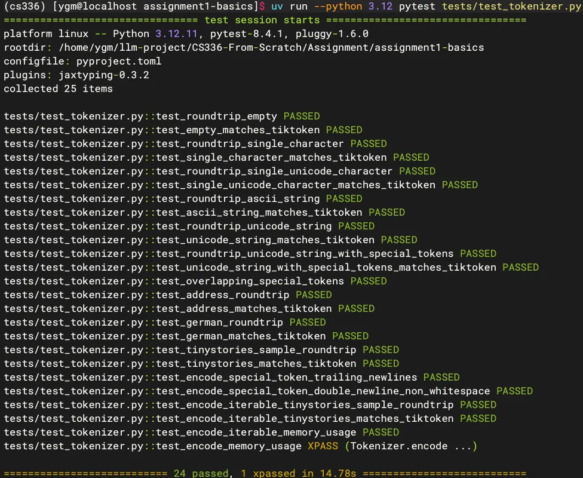
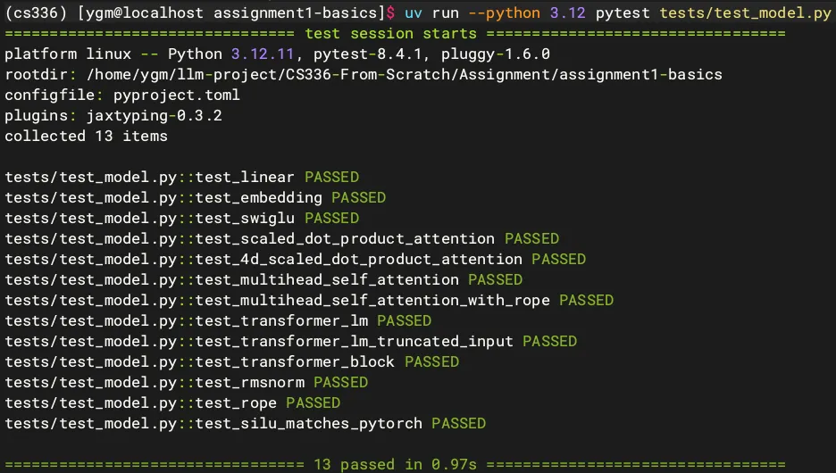
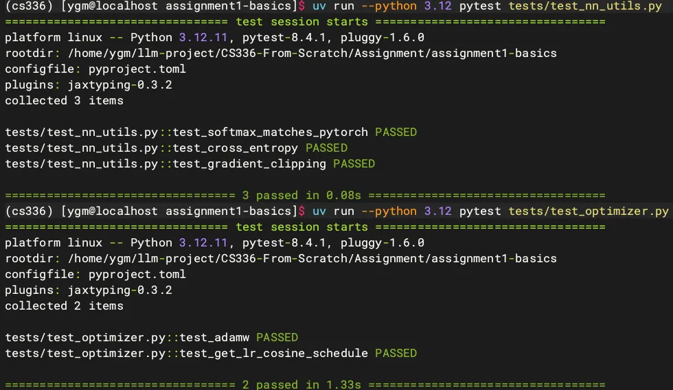
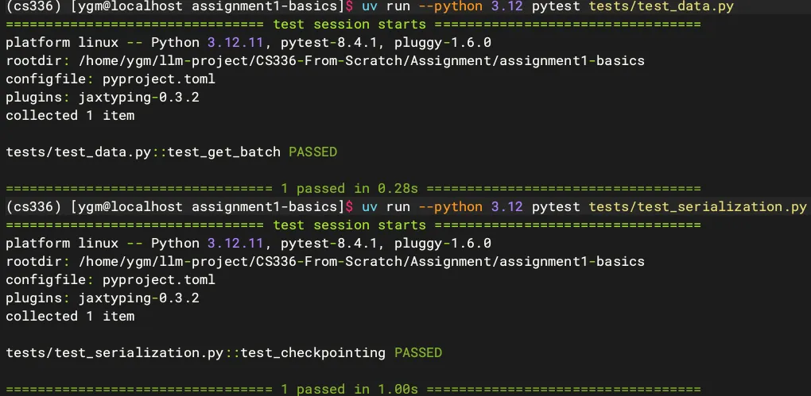

# CS336 Spring 2026 Assignment 1: Basics

For a full description of the assignment, see the assignment handout at
[cs336_spring2025_assignment1_basics.pdf](./cs336_spring2025_assignment1_basics.pdf)

If you see any issues with the assignment handout or code, please feel free to
raise a GitHub issue or open a pull request with a fix.

## Setup

### Environment

> ⚠️ Initially, all tests should fail with `NotImplementedError`s. To connect your implementation to the tests, complete the functions in [./tests/adapters.py](./tests/adapters.py).

We manage our environments with `uv` to ensure reproducibility, portability, and ease of use. Install `uv` [here](https://github.com/astral-sh/uv) (recommended), or run `pip install uv`/`brew install uv`.

We recommend reading a bit about managing projects in `uv` [here](https://docs.astral.sh/uv/guides/projects/#managing-dependencies) (you will not regret it!).

- OS: Linux CentOS 7

- GPU: 2 * RTX A100 80GB

✍️ We have full creative freedom to write the codes for various components under the `cs336_basics/` folder; subsequently, we bridge them to `adapters.py`, where we instantiate the classes and methods for testing purposes.

### Pip list

List the key packages as follow:

```sh
(cs336) [ygm@localhost CS336-From-Scratch]$ pip list
Package                   Version
------------------------- ------------
einops                    0.8.2
jaxtyping                 0.3.9
numpy                     1.26.4
pandas                    2.3.2
pandocfilters             1.5.1
pillow                    12.2.0
pip                       26.0.1
pytest                    9.0.3
pyzmq                     26.4.0
regex                     2026.4.4
tiktoken                  0.11.0
torch                     2.6.0
tqdm                      4.67.3
utils                     1.0.2
uv                        0.11.7
uv-build                  0.8.4
wandb                     0.23.0
websocket-client          1.9.0
wheel                     0.46.3
```


## Code Architecture

1. cs336_basics/*: The package is mostly empty by design, so you are free to organize your implementation.

2. tests/test_*.py: Public unit tests.

3. tests/adapters.py: This is the interface layer between the tests and your code.

```sh
cs336_basics/
  train_bpe.py    # train_bpe and supporting helpers
  tokenizer.py    # Tokenizer class, encode/decode/encode_iterable
  linear.py       # Linear implementation
  rmsnorm.py      # RMSNorm implementation
  embedding.py    # Embedding implementation
  swiglu.py       # SwiGLU implementation
  rope.py         # RoPE implementation
  scaled_xx.py    # Scaled_dot_attention class 
  multi_xxx.py    # MHA class
  scaled_xx.py    # Scaled_dot_attention class
  trxx_block.py   # TransformerBlock
  transxx_lm.py   # TransformerLM
  data.py         # get_batch and dataset helpers
  checkpoint.py   # save_checkpoint, load_checkpoint
```

## DataSet

### Download data
Download the TinyStories data and a subsample of OpenWebText

``` sh
mkdir -p data
cd data

wget https://huggingface.co/datasets/roneneldan/TinyStories/resolve/main/TinyStoriesV2-GPT4-train.txt
wget https://huggingface.co/datasets/roneneldan/TinyStories/resolve/main/TinyStoriesV2-GPT4-valid.txt

wget https://huggingface.co/datasets/stanford-cs336/owt-sample/resolve/main/owt_train.txt.gz
gunzip owt_train.txt.gz
wget https://huggingface.co/datasets/stanford-cs336/owt-sample/resolve/main/owt_valid.txt.gz
gunzip owt_valid.txt.gz

cd ..
```

## Test Assignment

Firstly, We shoule enter the root assignment1 root path:

```sh
(cs336) [ygm@localhost assignment1-basics]$ pwd
/home/ygm/llm-project/CS336-From-Scratch/Assignment/assignment1-basics
```

### 🚀 Quick Start

```sh
(cs336) [ygm@localhost assignment1-basics]$ uv run --python 3.12 pytest tests/test_train_bpe.py
```


```sh
(cs336) [ygm@localhost assignment1-basics]$ uv run --python 3.12 pytest tests/test_tokenizer.py
```




```sh
(cs336) [ygm@localhost assignment1-basics]$ uv run --python 3.12 pytest tests/test_model.py
```



```sh
(cs336) [ygm@localhost assignment1-basics]$ uv run --python 3.12 pytest tests/test_nn_utils.py

(cs336) [ygm@localhost assignment1-basics]$ uv run --python 3.12 pytest tests/test_optimizer.py
```



```sh
(cs336) [ygm@localhost assignment1-basics]$ uv run --python 3.12 pytest tests/test_data.py

(cs336) [ygm@localhost assignment1-basics]$ uv run --python 3.12 pytest tests/test_serialization.py
```




## Test Order

Don't start with `uv run pytest` every time. Use a progression that matches dependencies.

### Tokenizer line

```sh
uv run pytest tests/test_train_bpe.py
uv run pytest tests/test_tokenizer.py
```

### Core neural utilities

```sh
uv run pytest -k 'test_linear or test_embedding or test_silu or test_rmsnorm or test_swiglu'
uv run pytest -k 'test_softmax_matches_pytorch or test_cross_entropy or test_gradient_clipping'
```

### Attention and model

```sh
uv run pytest -k 'test_rope or test_scaled_dot_product_attention or test_4d_scaled_dot_product_attention'
uv run pytest -k 'test_multihead_self_attention or test_multihead_self_attention_with_rope'
uv run pytest -k 'test_transformer_block or test_transformer_lm'
```

### Training utilities

```sh
uv run pytest -k 'test_get_batch or test_adamw or test_get_lr_cosine_schedule or test_checkpointing'
```

### Final full run

```sh
uv run pytest
```


